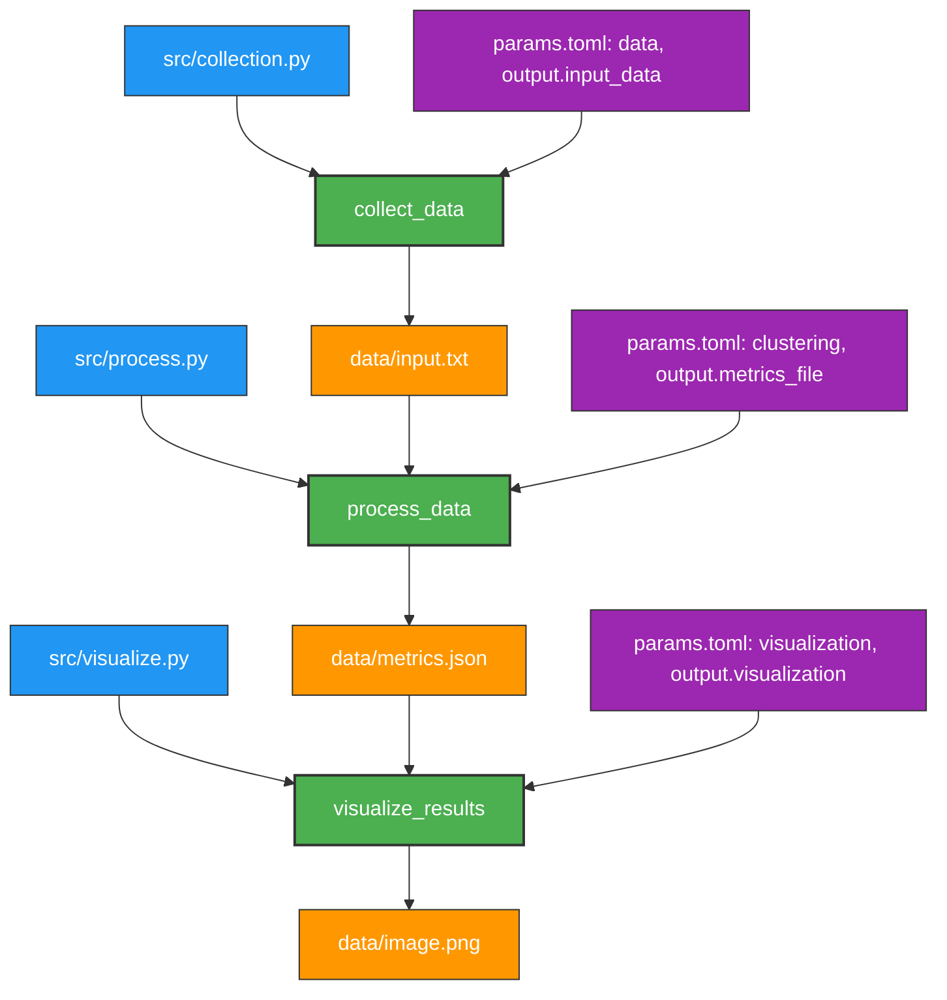

# DVC Pipeline Diagram

```mermaid
flowchart TD
    %% Stage 1: collect_data
    collect_deps1[src/collection.py]
    collect_params1[params.toml: data, output.input_data]
    collect_stage[collect_data]
    collect_out1[data/input.txt]
    
    collect_deps1 --> collect_stage
    collect_params1 --> collect_stage
    collect_stage --> collect_out1
    
    %% Stage 2: process_data
    process_deps1[src/process.py]
    process_params1[params.toml: clustering, output.metrics_file]
    process_stage[process_data]
    process_metrics1[data/metrics.json]
    
    process_deps1 --> process_stage
    collect_out1 --> process_stage
    process_params1 --> process_stage
    process_stage --> process_metrics1
    
    %% Stage 3: visualize_results
    viz_deps1[src/visualize.py]
    viz_params1[params.toml: visualization, output.visualization]
    viz_stage[visualize_results]
    viz_out1[data/image.png]
    
    viz_deps1 --> viz_stage
    process_metrics1 --> viz_stage
    viz_params1 --> viz_stage
    viz_stage --> viz_out1
    
    %% Styling
    classDef stageStyle fill:#4CAF50,stroke:#333,stroke-width:2px,color:#fff
    classDef depStyle fill:#2196F3,stroke:#333,stroke-width:1px,color:#fff
    classDef outStyle fill:#FF9800,stroke:#333,stroke-width:1px,color:#fff
    classDef paramStyle fill:#9C27B0,stroke:#333,stroke-width:1px,color:#fff
    
    class collect_stage,process_stage,viz_stage stageStyle
    class collect_deps1,process_deps1,viz_deps1 depStyle
    class collect_out1,viz_out1 outStyle
    class process_metrics1 outStyle
    class collect_params1,process_params1,viz_params1 paramStyle
```
